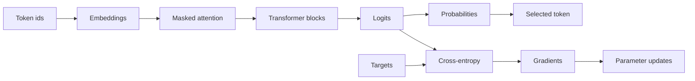

# ML foundations for AI engineers

A runnable course about the model mechanics an AI engineer needs when debugging,
evaluating, and sizing LLM systems. The examples use NumPy for visible math and
PyTorch for autograd and transformer code. Everything runs on CPU with synthetic
data. No API key, model download, GPU, or cloud account is required.

This is not a compressed ML degree. It leaves out broad surveys of classical models,
proof-heavy optimization, distributed training, and research-scale pretraining. The
goal is narrower: read tensor shapes, understand the numbers around a model call,
spot invalid conclusions, and have an informed conversation with an ML specialist.

## 0. The one big idea

> A model is a chain of numeric contracts, not a mysterious endpoint.

An output token sits at the end of a concrete path. Vectors meet shape rules. Logits
become probabilities. A target defines a loss. Gradients update parameters. Attention
restricts information flow. Sampling adds policy and random state. Calibration and
quantization change different properties. Memory depends on retained state, not a
parameter count alone.



The diagram has two paths because training and inference are different jobs. Training
uses targets and retains state for gradient updates. Inference selects outputs and may
retain a growing KV cache.

## 1. Setup

You need Python 3.12 or newer. The pins are NumPy 2.5.2 and PyTorch 2.13.0.

```bash
python3 -m venv .venv
source .venv/bin/activate
python -m pip install -r requirements.txt
python check_setup.py
```

The course never uses a GPU. On Linux or Windows, the official PyTorch CPU index avoids
downloading CUDA packages:

```bash
python -m pip install numpy==2.5.2
python -m pip install torch==2.13.0 --index-url https://download.pytorch.org/whl/cpu
python -m pip install -e . --no-deps
python check_setup.py
```

Run the complete local check at any time:

```bash
python -m unittest discover -s tests -v
python -m compileall -q ml_foundations examples hands_on tests check_setup.py
for example in examples/[0-9][0-9]_*.py; do python -W error "$example"; done
python hands_on/train_tiny_transformer.py
```

## 2. Vectors, matrices, and shapes

```bash
python examples/01_vectors.py
```

The first example separates geometry from shape. Cosine similarity measures direction
and rejects zero vectors. The affine calculation accepts a batch by input-width matrix,
an input-width by output-width weight matrix, and one output-width bias. It rejects
other broadcasting rather than letting a plausible-looking array hide the mistake.

The result to inspect is the shape equation:

```text
(2, 3) @ (3, 2) -> (2, 2)
```

Batch and sequence axes carry different meanings even when their lengths happen to
match. Name axes before rearranging them.

## 3. Stable softmax

```bash
python examples/02_softmax.py
```

Softmax exponentiates relative scores and normalizes them. A direct `exp(logit)` can
overflow, so the implementation subtracts the row maximum first. Adding or subtracting
one shared constant leaves the probabilities unchanged.

This invariance is useful and limited. It proves that softmax depends on score gaps. It
does not prove that a probability is calibrated against real outcomes.

## 4. Cross-entropy from logits

```bash
python examples/03_cross_entropy.py
```

Cross-entropy for one class is the negative log probability assigned to that target.
The example raises only the target logit, observes target probability rise, and checks
the NumPy loss against PyTorch. Production code should pass logits directly to
`torch.nn.functional.cross_entropy`; a separate softmax loses numeric stability.

The target is supervision. It is legitimate input to the training loss. It must not
also supply an evaluation threshold or tell a later verdict what answer to expect.

## 5. Gradients and gradient checks

```bash
python examples/04_gradients.py
```

The same scalar derivative is calculated analytically, with a centered finite
difference, and with PyTorch autograd. Agreement checks one local derivative. It does
not prove the objective is suitable, the data is representative, or the optimizer will
converge.

Finite differences have their own numeric policy. This course rejects epsilon below
`1e-8` for its float64 teaching calculation because cancellation can dominate. That is
not a universal epsilon for every dtype or scale.

## 6. Gradient descent and terminal states

```bash
python examples/05_gradient_descent.py
```

The scalar optimizer exposes its state before each update. A moderate learning rate
reaches the tolerance. A large rate keeps producing finite numbers but moves away from
the minimum until the budget ends.

| Observed condition | Status | Meaning |
| --- | --- | --- |
| Absolute gradient is at or below tolerance | `converged` | The declared local stop rule passed |
| Step budget ends first | `max_steps` | The run stopped without meeting the rule |
| A loss, gradient, or parameter becomes nonfinite | `diverged` | Numeric failure ended the run |

Calling both bad runs "divergence" would erase a useful operational distinction.

## 7. Scaled dot-product attention

```bash
python examples/06_attention.py
```

Queries score keys. The score divides by the square root of key width. A Boolean mask
removes forbidden relationships before softmax, then the weights mix value rows. Every
query must retain at least one allowed key.

The example changes the final value by two orders of magnitude. Earlier causal outputs
remain unchanged. That counterfactual checks information flow directly. Looking only at
the output shape would miss a broken mask.

## 8. A transformer block

```bash
python examples/07_transformer_block.py
```

`TinyTransformerBlock` is a readable pre-normalization block with multi-head causal
attention, a feed-forward network, and two residual additions. Model width must divide
evenly across heads. The block preserves batch, sequence, and model-width axes.

It omits dropout, rotary positions, grouped-query attention, fused projections, and KV
cache management. Use PyTorch's fused scaled-dot-product attention in real model code,
then test the same causality property around it.

## 9. Sampling controls

```bash
python examples/08_sampling.py
```

Sampling is policy applied to one logit row. The course makes the branches explicit:

| Policy input | Behavior |
| --- | --- |
| Greedy selection | Choose the largest logit; a tie chooses the lower token id |
| Temperature below one | Sharpen score gaps before sampling |
| Temperature above one | Flatten score gaps before sampling |
| `top_k=k` | Exclude every token outside the highest `k` logits |
| Injected generator | Make the random sequence reproducible from its state |

A seed is not global magic. Reproducibility depends on the exact generator state,
algorithm, inputs, and software path.

## 10. Held-out calibration

```bash
python examples/09_calibration.py
```

Accuracy asks whether argmax is correct. Calibration asks whether stated confidence
matches observed correctness. Temperature scaling divides logits by one positive scalar
and preserves argmax.

The example chooses temperature by cross-entropy on calibration rows, then measures ECE
on different test rows. The fitted temperature is 4.0 and held-out ECE changes from
0.2320 to 0.0189. That result belongs to this small synthetic set and this binning rule.
ECE can hide class and cohort errors, especially with small samples.

A grid search cannot see past its own endpoints. If the winning temperature is the
smallest or largest candidate, calibration loss was still falling when the grid ran out
and the data did not really choose that value. `fit_temperature` reports this as
`on_grid_boundary`, and the example prints it. A calibration split the model classifies
perfectly guarantees a boundary fit, because loss then falls all the way toward zero
temperature.

## 11. Quantization and reconstruction error

```bash
python examples/10_quantization.py
```

Symmetric quantization maps a floating range to signed integer levels with one scale.
The example compares logical int8 and int4 payloads on the same weights. Int4 uses fewer
payload bytes and has more reconstruction error.

The implementation stores logical values in an int8 NumPy array. Its sub-byte figure is
an accounting estimate, not an actual packed file. It benchmarks no kernel. Smaller
payload does not establish lower latency or higher throughput.

## 12. Training and inference memory

```bash
python examples/11_training_vs_inference_memory.py
```

A weights-only number is not a training-memory number. The default training estimate
names weights, gradients, fp32 master weights, two fp32 Adam moments, and saved
activations. The inference estimate names weights, current activations, and KV cache.

The formulas omit allocator overhead, temporary workspaces, fragmentation, sharding,
recomputation, and framework reuse. They are component checks. Measure peak allocated and
reserved memory on the target runtime before placing a workload.

## 13. Capstone: train and inspect a tiny transformer

```bash
python hands_on/train_tiny_transformer.py
```

The capstone joins the course without pretending to train a useful language model. It:

1. creates train, calibration, and test rotations with distinct start-token identities;
2. trains a one-block causal model on the rule "next token equals current token plus one";
3. fits temperature on calibration rows and measures accuracy and ECE on test rows;
4. reconstructs every parameter through logical int8 and measures test-logit drift;
5. accounts for named training and inference memory components;
6. samples with an injected random generator;
7. derives one verdict from requirements declared apart from the observations.

The current pinned run reports:

```text
train loss:       2.6799 -> 0.0009
test accuracy:    100.0%
test ECE:         0.0564 -> 0.0109 at T=0.50 (grid floor, unresolved)
int8 logit drift: 0.023969 mean absolute
weight payload:   22752 -> 5824 bytes
verdict:          ready_for_lab_use
```

The calibration line is the honest disappointment of this experiment. The model gets
every calibration row right, so no temperature grid can choose a value: loss keeps
falling toward zero temperature and the smallest candidate always wins. Widening the
grid downward drives held-out ECE to 0.0 and means nothing. The report prints
`grid floor, unresolved` and stores `temperature_on_grid_boundary` so the number is
never read as a fitted result. The mechanism is worth learning here; the fit is not.

The payload line compares the model's real fp32 parameter bytes with the logical int8
payload plus one float64 scale per tensor. It is an accounting estimate on this tiny
model, not a packed file and not a speed result.

The model receives next-token labels during training. It never receives the maximum
loss, minimum accuracy, maximum ECE, maximum drift, or split-lineage requirements that
judge the report. Tests change each bound independently and verify the verdict changes.
`ready_for_lab_use` means this deterministic experiment met that lab contract. It says
nothing about production readiness or behavior outside the cyclic dataset.

The script writes `training-report.json`. Git ignores the report because it is generated
evidence, not source.

## 14. Repository map

```text
ml_foundations/    Tested implementations used by lessons and capstone
examples/          Eleven numbered prediction and observation scripts
hands_on/          Deterministic tiny-transformer experiment
tests/             Numeric, boundary, counterfactual, and teaching-contract tests
TEXTBOOK.md        Explanations, derivations, and source notes
EXERCISES.md       Changes to make and claims to defend
LESSONS.md         What went wrong while building this course
check_setup.py     Offline installation and determinism check
```

## 15. What to study next

Use [LLM inference](https://github.com/alexvervloet/inference-platform-deep-dive)
for batching, KV-cache capacity, scheduling, and serving tradeoffs. Use
[Evals](https://github.com/alexvervloet/evals-deep-dive) for experiment design and
quality gates. Use [AI data engineering](https://github.com/alexvervloet/ai-data-engineering-deep-dive)
for lineage, corpus synchronization, and retrieval data contracts.

## Primary sources

- [Attention Is All You Need](https://arxiv.org/abs/1706.03762)
- [PyTorch transformer building blocks](https://docs.pytorch.org/tutorials/intermediate/transformer_building_blocks.html)
- [PyTorch `CrossEntropyLoss`](https://docs.pytorch.org/docs/stable/generated/torch.nn.CrossEntropyLoss.html)
- [PyTorch `MultiheadAttention`](https://docs.pytorch.org/docs/stable/generated/torch.nn.MultiheadAttention.html)
- [On Calibration of Modern Neural Networks](https://arxiv.org/abs/1706.04599)
- [A White Paper on Neural Network Quantization](https://arxiv.org/abs/2106.08295)
- [PyTorch installation selector](https://docs.pytorch.org/get-started/locally/)
- [NumPy 2.5.2 release listing](https://numpy.org/news/)

## License

MIT
