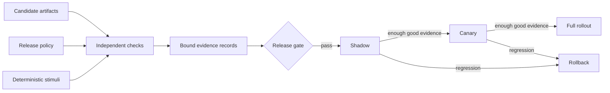

# Testing and Delivery: A Guided Deep Dive

A hands-on course for proving that an AI release is ready to move, rather than only that
its model produced a good answer once. You'll build a small delivery evidence pipeline from
the standard library: test portfolios, SDK contract fixtures, property tests, deterministic
doubles, load and fault tests, artifact compatibility, dependency locks, CI matrices,
security gates, staged rollouts, rollback, and release provenance.

Every lesson, test, and capstone scenario runs offline with deterministic synthetic data.
No API key, cloud account, deployment platform, or paid model needed.

This course follows [Evals](https://github.com/alexvervloet/evals-deep-dive), which teaches
how to measure application quality, and it complements
[Production](https://github.com/alexvervloet/ai-in-production-deep-dive), which teaches the
runtime machinery around a model call. Here, eval quality becomes one piece of a larger
question. Does this exact candidate have enough independent, reproducible evidence to ship
and to recover safely?

## 0. The one big idea

> **Delivery is an evidence pipeline, not a push.**

A release candidate should move only when evidence supports independently declared
requirements for behavior, quality, integration contracts, compatibility, supply chain,
operational limits, and recovery. A check must not take its expected answer from the same
input it judges. A passing result must name the candidate and the source revision it
actually tested.



The three incoming arrows matter. Candidate data supplies what you are testing, policy
supplies what has to be true, and stimuli exercise behavior. Combine those roles into one
object and you have built a circular check.

## 1. Setup

You need Python 3.11 or newer. The course has no runtime dependencies outside the standard
library.

```bash
python3 -m venv .venv
source .venv/bin/activate
python -m pip install -r requirements.txt
python check_setup.py
```

`check_setup.py` imports all twelve concept modules, parses the standard `pylock.toml`,
discovers a nonempty test suite, and runs the capstone twice in memory. It makes no network
call and writes no output file.

Run the complete local release path at any time:

```bash
python -m unittest discover -v
python -m compileall -q delivery_engineering examples hands_on tests check_setup.py
for example in examples/[0-9][0-9]_*.py; do python "$example"; done
python hands_on/release_candidate.py
```

## 2. Evidence portfolios, tested by failure mode

Unit tests answer whether a local code path obeys its contract. Evals answer whether the AI
application meets a quality bar on representative tasks. SDK contract tests answer whether
an integration still speaks the expected wire format. Load and fault tests answer whether
behavior holds under traffic and under failure.

```bash
python examples/01_test_portfolio.py
```

The example deliberately supplies green unit and eval observations while the independent
policy still requires a contract result. The subset gets blocked. That is the core
anti-vacuity rule for the rest of the course.

## 3. SDK contracts and recorded fixtures

A recorded HTTP exchange is valuable test data and it is not the specification. The
contract has to declare, independently, the required fields, JSON types, unknown-field
behavior, provenance metadata, and redaction policy. Otherwise recording a broken response
teaches the test to expect the same broken response.

```bash
python examples/02_contract_fixtures.py
```

The synthetic fixture in `fixtures/sdk/responses_create.json` holds no live credential and
no customer data. The example removes a required response ID and adds a field claiming what
the ID should have been. The independent contract still fails it at the exact JSON path.

## 4. Property and fuzz testing

Examples cover the cases you remembered. Properties state invariants over the cases you
never enumerated. A useful property test separates four things: a generator, an invariant,
a reproducible seed, and a shrinker that reduces a random failure to a small witness.

```bash
python examples/03_property_testing.py
```

The teaching runner uses bounded exhaustive integer shrinking so its mechanics stay
visible. It reports when the shrink budget ran out, rather than falsely calling the
original failure minimal. Use Hypothesis or another mature engine in production.

## 5. Deterministic mocks and fakes

A deterministic double controls time, randomness, external errors, and responses so a test
reproduces. It has to model behavior and never own the assertion. The expected answer
belongs to the product contract or the test, never to the same fake input that produced the
actual answer.

```bash
python examples/04_deterministic_doubles.py
```

`DeterministicModelFake` has one-shot scripted outcomes, reusable prompt behavior, and a
bounded call-history deque. Its retained state cannot grow forever, and its reset semantics
explicitly do not replay faults that were already consumed.

## 6. Load tests with explicit units

Load evidence starts with request events rather than a hand-written capacity label. The
course derives elapsed span in seconds, throughput in requests per second, latency in
milliseconds, and error rate as a ratio. Its p95 uses the documented nearest-rank
definition: sort `n` values and select one-based rank `ceil(0.95 * n)`.

```bash
python examples/05_load_testing.py
```

The same events are shifted one hour on the monotonic timeline. Duration-derived
measurements survive the shift, which is a unit-sensitive metamorphic check. They do
not survive it bit for bit: adding 3,600 to each timestamp costs low-order bits, so
the example prints the actual drift against a named tolerance rather than asserting
equality it cannot demonstrate. The error rate is a ratio of counts and is exactly
equal. Policy equality passes; only a value beyond a bound fails.

## 7. Fault tests, retries, and idempotency

The dangerous retry is not a clean failure before work starts. It is a response lost after
the server already committed a side effect. The client has no way to know whether retrying
will duplicate the operation.

```bash
python examples/06_fault_testing.py
```

The example applies the same after-commit fault to idempotent and non-idempotent
writers. Both eventually return success, but only the idempotent path records one
durable effect. Repeating the fault separates them further: the deduplicated reply
can be lost too, so as losses climb from one to three the idempotent effect count
stays at one while the non-idempotent count reaches four. Idempotency records are
bounded by `max_keys`; an evicted key can no longer deduplicate a very late retry.
A production retention window must exceed the supported retry horizon.

## 8. Prompt, model, index, and SDK compatibility

An AI release is a tuple of artifacts. A prompt may require tool calling and structured
output. A model has to support those features and carry enough context headroom. Retrieval
code needs the tested embedding dimensions and index schema. Application code needs the
expected SDK contract version.

```bash
python examples/07_compatibility.py
```

The example changes only the index schema and observes the actual release decision
flip. `allowed_models={"*"}` is the one explicit wildcard; strings such as
`"model-*"` are literal and do not silently widen approval.

## 9. Dependency locking and artifact integrity

Version ranges describe acceptable resolution inputs. A lock records the exact installation
result for supported environments. The repository ships a standard `pylock.toml`, the
format defined by PEP 751 and the current Python Packaging User Guide.

```bash
python examples/08_dependency_locking.py
```

The audit checks lock version, environment coverage, normalized names, exact versions where
present, strong artifact hashes, and immutable VCS commit IDs. It allows multiple entries
for one package, because the standard permits marker or source variants. This teaching
audit resolves no dependency graphs and evaluates no marker expressions.

## 10. CI matrices, or executing the support promise

`requires-python = ">=3.11"` is metadata. It becomes evidence only once CI runs on 3.11.
Testing a newer local interpreter alone cannot prove the lower bound.

```bash
python examples/09_ci_matrix.py
```

The matrix policy lists exact supported cells independently of the observed workflow jobs.
A missing minimum-runtime cell fails even when every newer job is green. Any repeat
observation of a required cell gets rejected, identical or not, because choosing between a
red run and a green rerun is how flakiness gets hidden.

## 11. Security scanning as bounded evidence

Dependency review, static analysis, secret scanning, license policy, and artifact
inspection each catch a different supply-chain risk. A successful scanner exit proves the
scanner completed and nothing more. Findings still need an independent severity policy, and
an empty finding set is no proof that no vulnerability exists.

```bash
python examples/10_security_scanning.py
```

The example joins installed versions with an independent synthetic advisory feed. No
finding carries an `expected` or `should_block` label. The security policy sets the
blocking severity and the license rules separately, and binds every report to the candidate
source revision.

## 12. Shadow traffic, canaries, and rollback

Shadow traffic sends a copy to the candidate and lets it cause no external side effects. A
canary exposes a small real slice. Both gather evidence against a policy fixed before
observation. Passing metrics with too little volume hold. A safety regression triggers
rollback even when volume is low.

```bash
python examples/11_staged_rollout.py
```

The example uses 500 requests, sitting between zero and the 1,000-request requirement, so
the hold decision cannot be an artifact of a zero-against-full tie. It then shows promotion
at the boundary and rollback under several simultaneous regressions.

## 13. Release evidence and provenance

A passing result has to identify what it tested. Every evidence record carries a candidate
subject digest, a source revision, a production time in UTC epoch seconds, a pass status,
and a digest of the actual decision payload.

```bash
python examples/12_release_evidence.py
```

Evidence exactly at the maximum age passes. Evidence one second older fails. Future
timestamps fail. This bundle is not a signature and not a full SLSA provenance statement.
Production builds should create signed attestations on a hardened build platform.

## 14. Capstone: release one candidate

```bash
python hands_on/release_candidate.py
```

The capstone runs all twelve decision paths and writes `release-evidence.json`. The default
candidate follows the derived stage path `shadow -> canary -> full`. The output holds the
single candidate identity, each actual decision payload, its matching evidence digest, the
portfolio decision, and the final freshness and lineage gate.

The adversarial suite proves that each important input reaches a real decision.

- remove the Python 3.11 CI job;
- delete the required SDK response ID;
- change the index schema;
- make after-commit retries non-idempotent;
- break the clamp property or deterministic model response;
- inject a high-severity advisory finding;
- regress canary quality, latency, and errors;
- reuse evidence after its freshness window.

Run just those scenarios with:

```bash
python -m unittest tests.test_capstone -v
```

## Repository map

```text
delivery_engineering/       twelve documented decision modules
examples/                   twelve predict-then-run lessons
fixtures/sdk/               synthetic recorded SDK exchange
fixtures/security/          independent synthetic advisory feed
hands_on/release_candidate.py
                            end-to-end release-evidence capstone
tests/                      unit, boundary, metamorphic, and adversarial tests
pylock.toml                 standard dependency-free runtime lock
check_setup.py              offline readiness and capstone smoke check
.github/workflows/ci.yml    minimum/current runtime release path
TEXTBOOK.md                 detailed models and production extensions
EXERCISES.md                modifications and reasoning prompts
```

## What this course deliberately simplifies

- The property runner handles integers only and shrinks by bounded enumeration.
- The load generator is synthetic and does not model coordinated omission or a
  distributed load generator.
- Retry delays are recorded, not slept; no real payment system is contacted.
- Marker strings in the lock audit are compared exactly, not semantically solved.
- Security findings come from a local training feed, not a live advisory database.
- Rollout telemetry is a deterministic window, not streaming production metrics.
- Evidence uses hashes but no signing key, transparency log, or trusted builder.

These choices keep the control flow inspectable. None of them claims the teaching
implementation is a production delivery platform.

## Primary references

- [Python `unittest.mock`](https://docs.python.org/3/library/unittest.mock.html),
  including specifications and autospeccing for interface drift.
- [Hypothesis documentation](https://hypothesis.readthedocs.io/), for mature
  property generation, shrinking, and stateful testing.
- [PyPA `pylock.toml` specification](https://packaging.python.org/en/latest/specifications/pylock-toml/),
  the current standardized Python lock format derived from PEP 751.
- [GitHub Actions matrix documentation](https://docs.github.com/en/actions/how-tos/write-workflows/choose-what-workflows-do/run-job-variations),
  for explicit job variation and matrix behavior.
- [GitHub dependency review action](https://docs.github.com/en/code-security/how-tos/secure-your-supply-chain/manage-your-dependency-security/configure-dependency-review-action),
  for dependency severity, scope, and license gates.
- [GitHub CodeQL documentation](https://docs.github.com/en/code-security/code-scanning/creating-an-advanced-setup-for-code-scanning),
  for current static-analysis workflow setup.
- [SLSA provenance specification](https://slsa.dev/spec/v1.2/provenance), for
  binding artifacts to build inputs and an authenticated build process.

## Troubleshooting

| Symptom | What it means and what to do |
| --- | --- |
| `ModuleNotFoundError: delivery_engineering` | Activate the virtual environment and run `python -m pip install -r requirements.txt` from this repository root. |
| `test discovery found zero tests` | Run from the repository root and confirm `tests/__init__.py` exists. CI treats zero tests as failure. |
| Capstone returns exit code 1 | Read `portfolio.violations`, then the matching `decisions` payload in `release-evidence.json`. |
| Lock audit rejects a package name | `pylock.toml` package names must use normalized lowercase hyphen form. |
| A shadow run rolls back | Check errors, p95 milliseconds, quality, and external side effects. Safety failures outrank low volume. |

The suggested sequence is
[Evals](https://github.com/alexvervloet/evals-deep-dive) ->
[Production](https://github.com/alexvervloet/ai-in-production-deep-dive) ->
this course -> the parent
[capstone](https://github.com/alexvervloet/deep-dive-capstone).
